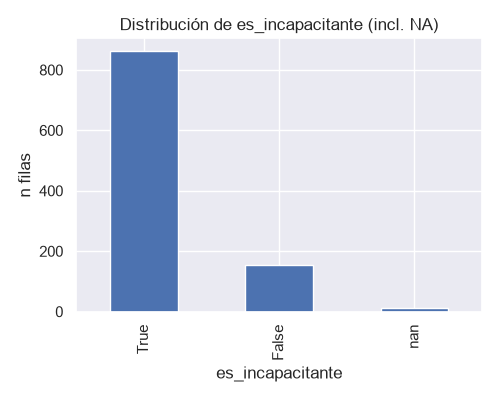
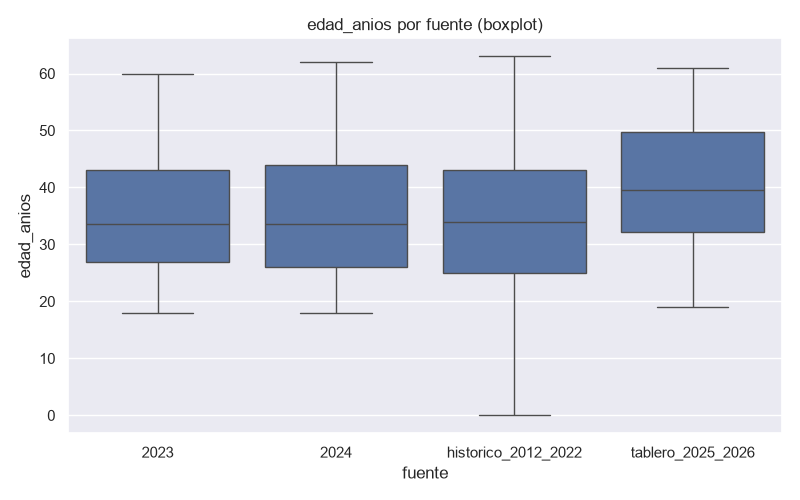
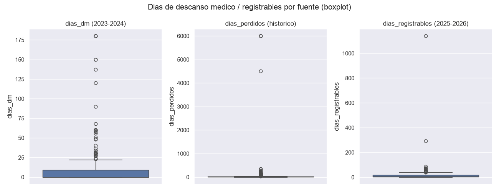

# Análisis Predictivo de Accidentes SST

Proyecto del curso de **Machine Learning Aplicado** — Ingeniería Industrial.

## 1. Problema central y contexto

El área de SST registra los accidentes que ocurren, pero no puede anticipar
cuáles van a derivar en días perdidos. Hoy, cuando se reporta un evento, el
jefe de SST necesita decidir cómo priorizar la atención y qué eventos escalar
a investigación a fondo — y esa decisión se toma por criterio del supervisor,
sin evidencia histórica que la respalde.

## 2. Objetivo del proyecto (medible)

Clasificar cada evento reportado como **incapacitante / no incapacitante**
con **recall ≥ 0.70 sobre la clase no incapacitante** (la clase minoritaria),
superando el baseline de predecir siempre la clase mayoritaria.

## 3. Tipo de problema de ML

**Supervisado, clasificación binaria.**

- Es supervisado porque el histórico ya trae, en la columna `gravedad`, el
  desenlace real observado de cada evento — no se busca estructura oculta en
  datos sin etiqueta, se tiene un objetivo definido y se quiere predecirlo.
- Es clasificación (no regresión) porque la variable objetivo es categórica
  con dos valores, no numérica continua.
- Es binaria (no multiclase) porque se colapsan las 12 categorías originales
  de `gravedad` en dos.
- Implicancia: métricas de clasificación (accuracy, precision, recall, F1,
  AUC-ROC) y matriz de confusión. Dado el desbalance de clases, **accuracy
  sola no sirve** — se prioriza recall y F1 sobre la clase minoritaria.

## 4. Variable objetivo (y): `es_incapacitante`

Booleana, derivada de la columna `gravedad` de
`data/processed/accidentes_historico_2012_2022.csv` (única fuente de las 5
que trae esta columna). `True` si el evento fue clasificado como
incapacitante (genera descanso médico), `False` si no incapacitante o
incidente.

**Reglas de agrupación**, implementadas en `src/clean.py`
(`derive_es_incapacitante`):

| Regla | Resultado |
|---|---|
| Contiene "INCAPACITANTE" sin "NO " previo | `True` |
| "NO INCAPACITANTE" | `False` |
| "INCIDENTE" (y variantes mal escritas, incl. "INCICENTE") | `False` |
| Cualquier otro valor (`"-"`, nulo, "DAÑO A LA SALUD", "ACCIDENTE FUERA DEL TRABAJO") | `NA` — excluido de entrenamiento, no se imputa ni se reclasifica |

Sobre las 1028 filas de `accidentes_historico_2012_2022.csv`: **861 `True`
(84.74%) / 155 `False` (15.26%)** con etiqueta definida, y 12 en `NA`
(excluidas de entrenamiento) — el desbalance ~85/15 que el modelo deberá
tratar explícitamente.



**Por qué no se usó `gravedad` cruda ni `dias_perdidos > 0`:** `gravedad`
tiene 12 categorías, varias con 1-3 casos y errores de tipeo — no es
entrenable así. `dias_perdidos > 0` da un desbalance peor (93/7) y además
tiene 11% de nulos.

## 5. Variables predictoras (X)

Solo sobre `accidentes_historico_2012_2022.csv` (única fuente con `gravedad`,
por lo tanto la única usable para este target).

| Columna | Grupo | Incluida | Motivo |
|---|---|---|---|
| `edad_anios` | Persona | Sí | Conocida al momento del evento |
| `sexo` | Persona | Sí | Conocida al momento del evento |
| `puesto_trabajo` | Trabajo | Sí | Conocida al momento del evento |
| `turno` | Trabajo | Sí | Conocida al momento del evento |
| `programa` | Trabajo | Sí | Conocida al momento del evento |
| `lugar` | Lugar | Sí | Conocida al momento del evento |
| `area_responsabilidad` | Lugar | Sí | Conocida al momento del evento |
| `fuente_peligro` | Evento | Sí | Conocida al momento del evento |
| `actividad_realizada` | Evento | Sí | Conocida al momento del evento |
| `mes` | Evento | Sí | Conocida al momento del evento |
| `anio` | Evento | Sí | Conocida al momento del evento |
| `experiencia_puesto_meses` | Persona | Sí | Conocida al momento del evento. Derivada de `experiencia_puesto` (texto libre) por `clean.parse_experiencia_puesto()`: convierte años/meses/semanas/días a meses sin adivinar — lo ambiguo (número sin unidad, comparaciones sin límite, valores concatenados) queda en `NA`. Detalle completo en [reports/diccionario_datos.md](reports/diccionario_datos.md#derivación-de-experiencia_puesto_meses-2026-09-17) |
| `dias_perdidos`, `dias_mas_ansi`, `parte_cuerpo_afectada`, `dano`, `cargo_ansi`, `nota_midot` | — | No | **Data leakage**: solo se conocen después del desenlace |
| `tipo_contacto` (100%), `nota_midot` (98.6%), `cargo_ansi` (97.7%), `modalidad` (95.7%), `nro_rom` (90%), `contrata` (73.3%) | — | No | Nulos >70% — el criterio de nulos manda sobre la relevancia conceptual |
| `nro_rom`, `id_persona` | — | No | Identificador, no predictor |
| `descripcion_accidente` | — | No, fuera de alcance de esta fase | Texto libre: requiere NLP (excede el curso) y puede contener nombres de trabajadores sin anonimizar |

## 6. Fuentes de datos

| Archivo (hoja) | Shape crudo | Shape procesado | Aporte |
|---|---|---|---|
| `Base de Accidentes 2023 _ Total.xlsx` (`Base`) | (306, 41) | `accidentes_2023.csv` → (107, 40) | Accidentes 2023. No tiene `gravedad` — no se usa para el target actual |
| `Base Accidentes 2024_Todo Alicorp.xlsx` (`Base`) | (281, 57) | `accidentes_2024.csv` → (281, 45) | Accidentes 2024. No tiene `gravedad` — no se usa para el target actual |
| `Resultados SST 2023 v06final.xlsx` (`HISTORICO ACCIDENTES`) | (1143, 26) | `accidentes_historico_2012_2022.csv` → (1028, 27) | **Fuente usada para X e y** — única con `gravedad` |
| `Tablero de Accidentes e incidentes.xlsx` (`2° Accidentes`) | (151, 44) | `accidentes_2025_2026.csv` → (151, 29) | Accidentes 2025-2026. No tiene `gravedad` — no se usa para el target actual |
| `Tablero de Accidentes e incidentes.xlsx` (`1° Incidentes`) | (343, 8) | `incidentes_2025_2026.csv` → (340, 9) | Incidentes (evento distinto a accidente) 2025-2026. No tiene `gravedad` |
| `BASE CALCULO INDICADORES 2024.xlsx` | — | No procesado | Indicadores ya agregados, sin registro fila-por-evento |

Los 5 CSV procesados están anonimizados (`id_persona` en vez de nombre/DNI) y
son commiteables. Detalle completo de columnas y decisiones de limpieza por
fuente en [reports/diccionario_datos.md](reports/diccionario_datos.md).

## 7. EDA

**Lo aplicado hoy** (`notebooks/00_inventario_fuentes.ipynb` y
`notebooks/01_eda_accidentes.ipynb`, ejecutados de punta a punta): inventario
de las 5 fuentes crudas, reporte de nulos por columna
(`clean.report_nulls`), distribución de accidentes por mes/año, top áreas
con más accidentes, distribución por sexo — sobre `accidentes_2023`/`2024`,
más una vista combinada de accidentes por año (2012-2026) usando solo las
columnas comunes a las 4 fuentes de accidentes.

**Hallazgos relevantes para la problemática (recall/priorización):**
**PENDIENTE** — el EDA existente es descriptivo y se hizo antes de definir
`y`; no tiene todavía hallazgos evaluados contra `es_incapacitante`.

**Matriz de correlación:** **PENDIENTE** — no calculada aún (confirmado: no
hay ninguna llamada a `.corr()` en `src/` ni en los notebooks). Plan
acordado: Pearson entre las 3 columnas numéricas de X (`edad_anios`, `mes`,
`anio` — `experiencia_puesto` queda fuera de X, ver sección 5) para detectar
redundancia; Cramér's V + tablas de contingencia / tasa de incapacitantes por
categoría para las columnas categóricas contra `y` (con nota de que en
`lugar`/`fuente_peligro`/`puesto_trabajo`, de cardinalidad muy alta, el
resultado es poco confiable por celdas con `n<5` — interpretar solo el orden
de magnitud). El objetivo es descartar X redundantes, no medir importancia
(eso lo dará el modelo en fase 2).

## 8. Preparación de datos

Transformaciones que aplica hoy el código (ninguna imputa nulos salvo la
excepción marcada, ninguna hace deduplicación, encoding ni escalado):

| Transformación | Dónde |
|---|---|
| Renombrado de columnas a snake_case | `src/ingest.py`, diccionarios `_RENAME_*`, vía `.rename()` en cada `load_*()` |
| Eliminación de filas sin dato real | `load_base_accidentes("2023")`: descarta 199 filas sin `Fecha` (306→107); `load_accidentes_tablero`/`load_incidentes`: `dropna(how="all")` |
| Eliminación de columnas artefacto | `load_base_accidentes("2024")` descarta columnas `Unnamed`; `load_accidentes_tablero` descarta 14 columnas de seguimiento no interpretables + 3 de identidad |
| Parseo de fechas | `_parse_mixed_excel_date()` (serial de Excel + texto DD/MM/AAAA, `errors="coerce"`) |
| Coerción numérica | `pd.to_numeric(errors="coerce")` sobre columnas numéricas declaradas |
| Normalización de categóricas | `clean.normalize_categorical()`: mayúsculas, sin tildes, dtype `category` |
| Mapeo de booleanos | dict `_BOOL_MAP` (`SI`/`SÍ`→`True`, `NO`→`False`) vía `.map()` |
| Anonimización | `clean.anonymize_column()`: SHA-256 truncado a 12 car., salt fijo del proyecto |
| Imputación | Ninguna, salvo `es_recategorizado` (2024): blanco→`False` porque es un casillero tipo flag, no un dato faltante |
| Derivación de `es_incapacitante` | `clean.derive_es_incapacitante()` — reglas en la sección 4 |
| Derivación de `experiencia_puesto_meses` | `clean.parse_experiencia_puesto()`: texto libre → meses; lo ambiguo (sin unidad, comparaciones, valores concatenados, texto sin explicar) queda en `NA`, no se adivina — ver diccionario, "Derivación de `experiencia_puesto_meses`" |
| Manejo de outliers | Se reportan todos (IQR, `clean.report_outliers_iqr()`) y se visualizan (boxplot); solo se corrigen a `NA` los que violan una regla de negocio verificable — ver detalle abajo |

**Outliers: qué se corrigió y qué no (regla: solo se toca lo que viola una
regla de negocio verificable, nunca un valor solo por ser estadísticamente
extremo):**

| Corregido a `NA` | Regla de negocio |
|---|---|
| `edad_anios <= 0` (histórico, 4 filas) | Una edad de 0 es imposible para un trabajador |
| `tiempo_experiencia_meses` donde `/12 > edad_anios` (2024, 2 filas) | Nadie tiene más años de experiencia que de vida |
| `dias_perdidos`/`dias_mas_ansi == 6000` (histórico, 4 filas) | Mismo valor exacto repetido en accidentes no relacionados — más compatible con un tope/placeholder del sistema que con un dato real |

**Sin corregir a propósito** (extremos estadísticos sin regla de negocio que
los marque como error): `dias_dm`, `dias_dm_total_indicador`, `nota_midot`,
`dias_registrables`, `tiempo_empresa_meses`/`tiempo_empresa_anios`. Capar o
eliminar estos solo por ser grandes sería inventar un criterio, no corregir
un error confirmado.




Más boxplots en `reports/figures/outliers_boxplot_*.png`
(`01_eda_accidentes.ipynb`). Detalle completo en
[reports/diccionario_datos.md](reports/diccionario_datos.md#valores-atípicos-outliers).

Justificación completa de cada decisión en
[reports/diccionario_datos.md](reports/diccionario_datos.md), sección
"Bitácora de decisiones de limpieza".

## 9. Estado actual y qué sigue

> **Fase 1: ingesta, EDA y limpieza — sin modelado aún.**

Las 5 fuentes de `data/raw/` ya fueron auditadas; 4 están procesadas y
anonimizadas en `data/processed/` (1567 accidentes + 340 incidentes en
total, entre las 4 fuentes de accidentes/incidentes). El problema, el target
(`es_incapacitante`) y las X candidatas ya están definidos con el equipo
(secciones 1-5), la derivación de `es_incapacitante` y el agrupamiento de
`turno` ya están implementados (`src/clean.py`), y el EDA dirigido
(`02_eda_dirigido.ipynb`, 6 preguntas con figuras en `reports/figures/`) ya
corre de punta a punta.

**Hecho en este hito:**

- [x] Derivación de `es_incapacitante` en `src/clean.py`
      (`derive_es_incapacitante`), documentada en el diccionario.
- [x] Sinónimos de `turno` agrupados (`normalize_turno()`), aprobado por el
      equipo.
- [x] `es_considerado`/`es_recategorizado`/`es_hard_stop`/`es_verificado`
      retipadas a `boolean` nullable, alineadas con `schema.py`.
- [x] EDA dirigido con Pearson + Cramér's V + tasas de incapacitante,
      6 preguntas con figuras — celdas de hallazgo dejadas en blanco a
      propósito para que el equipo interprete.
- [x] Notebooks re-ejecutados de punta a punta, `Pendiente` desactualizado
      corregido, columnas no documentadas completadas en el diccionario.
- [x] Decisión confirmada sobre las 2 filas de `gravedad` ambiguas ("DAÑO A
      LA SALUD" / "ACCIDENTE FUERA DEL TRABAJO"): quedan en `NA`, excluidas
      de entrenamiento/evaluación — no se reclasifican ni se eliminan filas.
- [x] Outliers que violan una regla de negocio verificable, corregidos a
      `NA` (`edad_anios`, `tiempo_experiencia_meses`,
      `dias_perdidos`/`dias_mas_ansi` — ver sección 8); el resto se deja
      igual, documentado.
- [x] Columnas con >80% de nulos: se decide dejarlas en `data/processed/`
      sin eliminar en esta fase (ver diccionario, sección "Nulos detectados").
- [x] `lugar`/`fuente_peligro`/`puesto_trabajo`: se decide diferir su
      agrupamiento (no inventar equivalencias de dominio sin criterio
      verificable) — mismo principio que la decisión de `turno`.
- [x] Completadas las 6 celdas `### Hallazgo` de `02_eda_dirigido.ipynb`.
- [x] `experiencia_puesto` normalizada a `experiencia_puesto_meses`
      (`clean.parse_experiencia_puesto()`) y agregada a X — ver sección 5 y
      diccionario, "Derivación de `experiencia_puesto_meses`".
- [x] Revisión humana de una muestra de 132 filas de texto libre redactado
      (`descripcion_accidente`/`descripcion_incidente`/
      `danos_reales_o_potenciales`): encontró 6 filas con fuga real
      (nombres de una sola palabra, títulos, menciones repetidas) que la
      heurística anterior no cubría — corregido en `clean.redact_pii_libre()`
      y verificado antes/después sobre las 5 fuentes. Detalle completo en
      diccionario, "Revisión humana de texto redactado (2026-09-17)".

Dato aparte: `BASE CALCULO INDICADORES 2024.xlsx` es el único archivo de
`data/raw/` que no se procesó — son indicadores ya agregados (no fila por
evento), así que no aporta registros nuevos para modelar.

## Estructura de carpetas

```
.
├── data/
│   ├── raw/          # Data original de la empresa, SOLO LECTURA. Nunca se modifica ni se commitea.
│   ├── interim/       # Data intermedia (pasos de limpieza en curso).
│   └── processed/     # Data final, lista para EDA/modelado.
├── notebooks/
│   ├── 00_inventario_fuentes.ipynb   # Inventario y primer vistazo a las fuentes crudas.
│   └── 01_eda_accidentes.ipynb       # Análisis exploratorio de datos.
├── src/
│   ├── config.py      # Rutas del proyecto y constantes (sin hardcodear rutas absolutas).
│   ├── schema.py       # Definición del esquema de columnas (nombres, tipos, categorías).
│   ├── ingest.py        # Carga de los archivos crudos (.xlsx) a DataFrames.
│   └── clean.py         # Funciones de limpieza y normalización reutilizables.
├── reports/
│   ├── figures/                # Gráficos exportados del EDA.
│   └── diccionario_datos.md    # Diccionario de datos y bitácora de decisiones de limpieza.
├── .github/
│   └── pull_request_template.md
├── CLAUDE.md            # Reglas del proyecto para trabajo asistido por IA.
├── pyproject.toml
└── .gitignore
```

Los notebooks solo importan funciones de `src/` y muestran resultados; la
lógica reutilizable (carga, limpieza, validación de esquema) vive en `src/`.

## Instalación y ejecución (con `uv`)

```bash
# 1. Instalar dependencias (crea el entorno virtual automáticamente)
uv sync

# 2. Levantar Jupyter para trabajar los notebooks
uv run jupyter lab

# 3. Lint (opcional, antes de commitear)
uv run ruff check .
```

## Flujo de ramas

```
main (protegida)
  └── develop
        └── feature/<nombre-de-la-tarea>
```

- Todo trabajo nuevo sale de `develop` en una rama `feature/*`.
- No se commitea directo a `develop`: se abre Pull Request desde `feature/*` hacia `develop`.
- `main` se actualiza solo desde `develop`, vía PR revisado.

### Convención de commits

Se usa [Conventional Commits](https://www.conventionalcommits.org/):

```
feat: agregar función de carga de accidentes 2024
fix: corregir dtype de columna fecha_evento
chore: actualizar .gitignore
docs: documentar diccionario de datos
```

## ⚠️ Confidencialidad de la data

La data en `data/` proviene de una empresa real y es **confidencial**:

- **`data/raw/` y `data/interim/` nunca se versionan**, en ningún formato
  (`.gitignore` los ignora por completo, más `*.xlsx`/`*.xls` en cualquier
  carpeta como red de seguridad extra).
- **Única excepción:** los `.csv` finales y **anonimizados** en
  `data/processed/` sí se pueden commitear. Ver el flujo completo de
  limpieza, guardado y anonimización en [CONTRIBUTING.md](CONTRIBUTING.md)
  antes de subir uno.
- Antes de compartir cualquier salida (notebook, figura, reporte, `.csv`),
  anonimizar nombres, DNI y legajos (hash o ID sintético —
  `clean.anonymize_column`).
- **Checklist antes de cualquier `git add` / `git push`:**

  ```bash
  git ls-files data/   # solo debe listar .csv dentro de data/processed/
  ```

  Si aparece algo de `data/raw/`, `data/interim/`, o un `.xlsx`/`.xls`,
  **no hacer push** y avisar al equipo.
